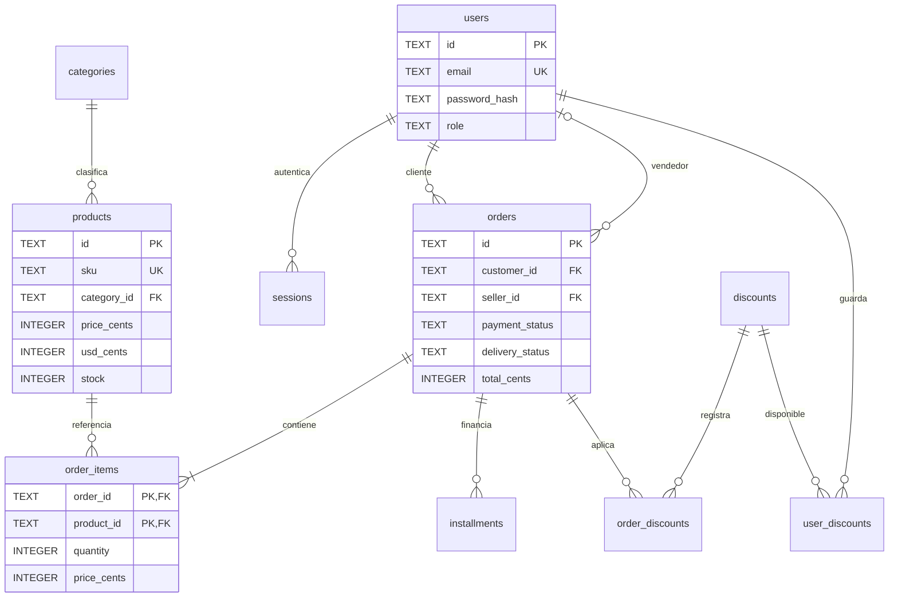

# Modelo relacional de Ferretería Cayo

Los importes monetarios se guardan en céntimos. order_items conserva nombre, SKU y precio de la compra. order_discounts conserva el código, tipo y valor aplicados. Las claves foráneas impiden eliminar referencias históricas. audit_log conserva actor, acción, entidad y fecha de las operaciones críticas sin contraseñas ni tokens. El esquema completo es database/schema.sql.
